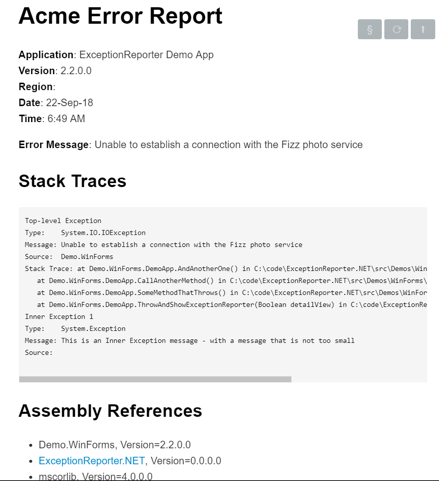
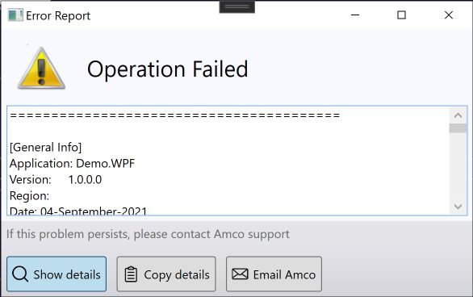

# Exception Reporter.NET

[](https://ci.appveyor.com/project/pandawood/exceptionreporter-net/build/tests)
&nbsp;[](https://www.nuget.org/packages/ExceptionReporter/)

```
PM> Install-Package ExceptionReporter
```

## How it Looks

When showing a dialog to the user (can also be sent silently) there are
 2 presentation *modes* - *Less Scary* and *More Detail*

#### **Less Scary**


#### **More Detail**


### Interface Configuration
You don't have to modify the code to achieve a basic level of customization as many changes can be made with *configuration*. 

The screenshot above is configured to not show icons on the buttons 
(`ShowButtonIcons`) and the window title is customised (`TitleText`)

There are various other options available such hiding the email button (`ShowEmailButton`), changing
 the label text (`UserExplanationLabel`), the background color (`BackgroundColor`) 
 etc - see the property  `Config` on the main `ExceptionReporter` class.

## How to use it

The Exception Reporter can be invoked manually or by setting up a Windows 
Exception event - 
see [Sample Code Usage](https://github.com/PandaWood/Exception-Reporter/wiki/Sample-Usage)

The ultimate goal is the developer receiving a formatted exception report - see
[Sending a Report](https://github.com/PandaWood/Exception-Reporter/wiki/Sending-a-Report)

You can even format your own report using [Report Templates](https://github.com/PandaWood/Exception-Reporter/wiki/Report-Templates)

## Why use it
### Some Important Features

- Option to send a report silently and asynchronously - ie without showing a dialog
- Send a report using various methods:
  - RESTful API/WebService
  - to Email address via SMTP 
  - to Email address via installed client (SimpleMAPI)
 - Emailing includes support for automatically attaching files and compressing 
 into a single zip file - useful for including log files and configuration files to help with troubleshooting
- The report sent to the developer can be in various formats (v4):
  - Plain Text 
  - HTML
  - Markdown
  - Custom - write your own Handlebars/Mustache template to create the report
- The report includes various useful information such as:
  - **Full Stack Trace** (including inner exceptions and multiple exceptions)
  - **System Information** (using WMI) such as OS Version, Memory, Language, TimeZone etc. 
  - A list of **Referenced Assemblies** (with versions) being used by the current executable
  - **Details of your App** such as name/version/date/time etc

### Demos, Design and Testing
- The solution includes a demo WinForms (and WPF - see below) app for testing the dialog as well as a WebService project to demonstrate the requirements of sending reports to a WebService (written in .NET Core)
- The source code has tried to incorporate unit testing and testability with over 60 unit tests (and growing) covering most of the important code
- ExceptionReporter is designed using the [MVP or Model-View-Presenter](https://medium.com/@prajvalprabhakar/mvp-vs-mvvm-93657494106b) pattern and the classes and concerns are liberally separated using [SOLID](https://stackify.com/solid-design-principles/) design principles (to the best of our ability)

## Sample Reports

### Markdown


### Plain Text
```text
========================================
Acme Error Report

Application: ExceptionReporter Demo App
Version:     4.0
Region:      English (Australia)
Date: 25/08/2018
Time: 2:40 PM
User Explanation: "I just pressed Connect and this error showed immediately"

Error Message: Unable to establish a connection with the Foo bank account service
 
[Stack Traces]
Top-level Exception
Type:        System.IO.IOException
Message:     Unable to establish a connection with the Foo bank account service. The error number is #FFF474678.
Source:      WinFormsDemoApp
Stack Trace: at WinFormsDemoApp.DemoAppView.AndAnotherOne() in Z:\MyProjects\ExceptionReporter\src\WinFormsDemoApp\DemoAppView.cs:line 110
    at WinFormsDemoApp.DemoAppView.CallAnotherMethod() in Z:\MyProjects\ExceptionReporter\src\WinFormsDemoApp\DemoAppView.cs:line 101
    at WinFormsDemoApp.DemoAppView.SomeMethod() in Z:\MyProjects\ExceptionReporter\src\WinFormsDemoApp\DemoAppView.cs:line 96
    at WinFormsDemoApp.DemoAppView.ShowExceptionReporter(Boolean useConfig) in Z:\MyProjects\ExceptionReporter\src\WinFormsDemoApp\DemoAppView.cs:line 81

Inner Exception 1
Type:        System.Exception
Message:     This is an Inner Exception message - with a message that is not too small but perhaps it should be smaller

[Assembly References] 
mscorlib, Version=2.0.0.0
System.Windows.Forms, Version=2.0.0.0
System, Version=2.0.0.0
ExceptionReporter.WinForms, Version=2.1.2.0
System.Drawing, Version=2.0.0.0
EO.WebBrowser, Version=16.0.91.0
Esent.Collections, Version=1.9.3.2

[System Info]
Operating System
-Microsoft Windows 7 Enterprise
--CodeSet = 1252
--CSDVersion =
--CurrentTimeZone = 600
--FreePhysicalMemory = 1947848
--OSArchitecture = 32-bit
--OSLanguage = 1033
--ServicePackMajorVersion = 0
--ServicePackMinorVersion = 0
--Version = 6.1.7600

[Machine]
--Manufacturer = Gigabyte Technology Co., Ltd.
--Model = P35-DS3L
--TotalPhysicalMemory = 3756515328

========================================
```

## Build 
ExceptionReporter has a dependency on the [.NET4 Framework](https://en.wikipedia.org/wiki/.NET_Framework_version_history#.NET_Framework_4) - so can go as low as supporting Windows XP

*ExceptionReporter.NET.sln* - this uses [the new csproj format](https://docs.microsoft.com/en-us/dotnet/core/tools/csproj) that was introduced in .NET Core but is backward compatible for .NET projects (like this).

There is a suite of Unit Tests to support ExceptionReporter using [Moq](https://github.com/Moq/moq4/wiki/Quickstart) and [NUnit](https://nunit.org/) libraries - see **src/Tests/Tests.ExceptionReporter.NET**

There is a [Cake](https://cakebuild.net) script to build the project and run all tests
- **build/build.sh** for OSX/Mono
- **build/build.ps1** for Windows

## WPF
I have worked a WPF version of ExceptionReporter into the solution by using a [Shared Project](https://docs.microsoft.com/en-us/xamarin/cross-platform/app-fundamentals/shared-projects). There is no nuget library for the WPF version yet, so it's in a kind of alpha-mode.
The usage is slightly different as it's implemented as a UserControl, so you create your own Window object and set the `Content` property to the `WpfExceptionReporter` - see the `Demo.WPF` project for an example.
The WPF version cuts out the resizing and the less/more detail view. For "Show Details" we just show the report in a read-only text component. I'm actually liking the simplicity, so I don't think it will take long to progress this into a sister nuget library.




