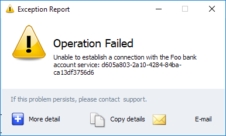
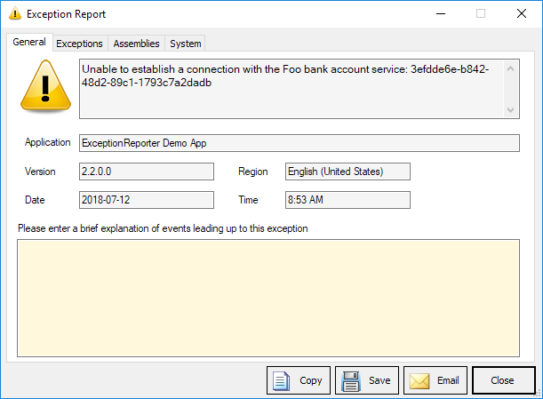
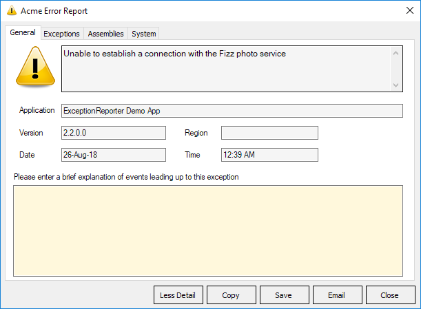

# Exception Reporter.NET

[](https://ci.appveyor.com/project/pandawood/exceptionreporter-net/build/tests)
&nbsp;[](https://www.nuget.org/packages/ExceptionReporter/)

```
PM> Install-Package ExceptionReporter
```

## How it Looks

You can show a dialog to the user (reports can also be sent silently). There are
 2 *modes* - *Less Detail* and *More Detail*

### **Less Detail** mode


### **More Detail** mode


#### Interface Configuration Options
We don't want you to have to modify the code yourself to achieve a basic level
of customization, so various changes can be made with *configuration*. 

The screenshot below is configured to not show icons on the buttons 
(`ShowButtonIcons`) and the window title is customised (`TitleText`)

There are various other options available such hiding the email button (`ShowEmailButton`), changing
 the label text (`UserExplanationLabel`), the background color (`BackgroundColor`) 
 etc - see the property  `Config` on the main `ExceptionReporter` class.



## How it works

The Exception Reporter can be invoked manually or by setting up a Windows 
Exception event - 
see [Sample Code Usage](https://github.com/PandaWood/Exception-Reporter/wiki/Sample-Usage)

The ultimate goal is the developer receiving a formatted exception report - see
[Creating and Sending a Report](https://github.com/PandaWood/Exception-Reporter/wiki/Creating-and-Sending-a-Report)


## Some Important Features

- Gathers inner exceptions and accepts multiple exceptions
- Option to send a report silently (and asynchronously) - ie without showing a dialog
- Send a report using various methods:
  - RESTful API/WebService
  - to Email address via SMTP 
  - to Email address via installed client (SimpleMAPI)
 - Emailing includes support for automatically attaching files and compressing 
 into a single zip file - useful for including log and config files to help with troubleshooting
- The report sent to the developer can be in various formats (v4):
  - Plain Text 
  - HTML
  - Markdown
  - Custom - your own Handlebar/Mustache template can be used to create the report
- The report includes various information such as:
  - Full exception **stack trace** (including inner exception and multiple exceptions)
  - **System information** (using WMI) such as CPU, AvailableMemory, OSLanguage, 
Versions etc. 
  - A list of **referenced assemblies** (with versions) being used by the current 
executable
   - Details of your App such as name/version/date/time etc

### Demos & Help
- The solution includes a Demo App for testing config and sending reports via 
Email/WebService
- The solution also includes a .NET Core REST/WebService project to demonstrate
 the requirements of sending reports to a WebService

## Sample Report

Here is a sample of the preset Plain Text report:

```text
========================================
Exception Report

Application: ExceptionReporter Demo App
Version:     4.0
Region:      English (Australia)
Date: 25/08/2018
Time: 2:40 PM
User Explanation: "I just pressed Connect and this error showed immediately"

Error Message: Unable to establish a connection with the Foo bank account service
 
[Stack Traces]
Top-level Exception
Type:        System.IO.IOException
Message:     Unable to establish a connection with the Foo bank account service. The error number is #FFF474678.
Source:      WinFormsDemoApp
Stack Trace: at WinFormsDemoApp.DemoAppView.AndAnotherOne() in Z:\MyProjects\ExceptionReporter\src\WinFormsDemoApp\DemoAppView.cs:line 110
    at WinFormsDemoApp.DemoAppView.CallAnotherMethod() in Z:\MyProjects\ExceptionReporter\src\WinFormsDemoApp\DemoAppView.cs:line 101
    at WinFormsDemoApp.DemoAppView.SomeMethod() in Z:\MyProjects\ExceptionReporter\src\WinFormsDemoApp\DemoAppView.cs:line 96
    at WinFormsDemoApp.DemoAppView.ShowExceptionReporter(Boolean useConfig) in Z:\MyProjects\ExceptionReporter\src\WinFormsDemoApp\DemoAppView.cs:line 81

Inner Exception 1
Type:        System.Exception
Message:     This is an Inner Exception message - with a message that is not too small but perhaps it should be smaller

[Assembly References] 
mscorlib, Version=2.0.0.0
System.Windows.Forms, Version=2.0.0.0
System, Version=2.0.0.0
ExceptionReporter.WinForms, Version=2.1.2.0
System.Drawing, Version=2.0.0.0
EO.WebBrowser, Version=16.0.91.0
Esent.Collections, Version=1.9.3.2

[System Info]
Operating System
-Microsoft Windows 7 Enterprise
--CodeSet = 1252
--CSDVersion =
--CurrentTimeZone = 600
--FreePhysicalMemory = 1947848
--OSArchitecture = 32-bit
--OSLanguage = 1033
--ServicePackMajorVersion = 0
--ServicePackMinorVersion = 0
--Version = 6.1.7600

[Machine]
--Manufacturer = Gigabyte Technology Co., Ltd.
--Model = P35-DS3L
--TotalPhysicalMemory = 3756515328

========================================
```

## Build 
ExceptionReporter has a dependency on the [.NET4 Framework](https://en.wikipedia.org/wiki/.NET_Framework_version_history#.NET_Framework_4) - so can go as low as supporting Windows XP

There is a suite of Unit Tests to support ExceptionReporter using [Moq](https://github.com/Moq/moq4/wiki/Quickstart) and [NUnit](https://nunit.org/) libraries. 
We're always working toward higher coverage and the tests run every commit via AppVeyor

[](https://ci.appveyor.com/project/PandaWood/exceptionreporter-net)
